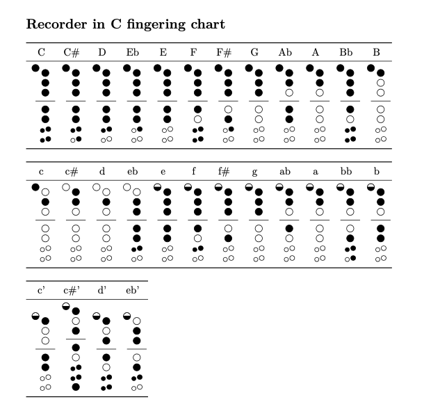

# recorder-fingering

Version 1.4 February 2, 2025

The `recorder-fingering` package provides support for generating fingering diagrams for baroque fingering recorders and the tin whistle. Standard fingerings are provided for recorders in both C and F, and the tin whistle in D, along with methods to create and display alternate fingerings for trills, etc.

# Sample of what you can do with it:

