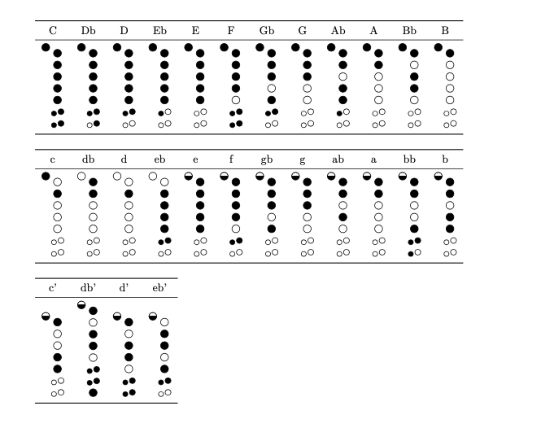

# recorder-fingering

Version 1.1 February 20, 2023

The `recorder-fingering` package provides support for generating fingering diagrams for baroque fingering recorders. Standard fingerings are provided for recorders in both C and F, along with methods to create and display alternate fingerings for trills, etc. 

# Sample of what you can do with it:

